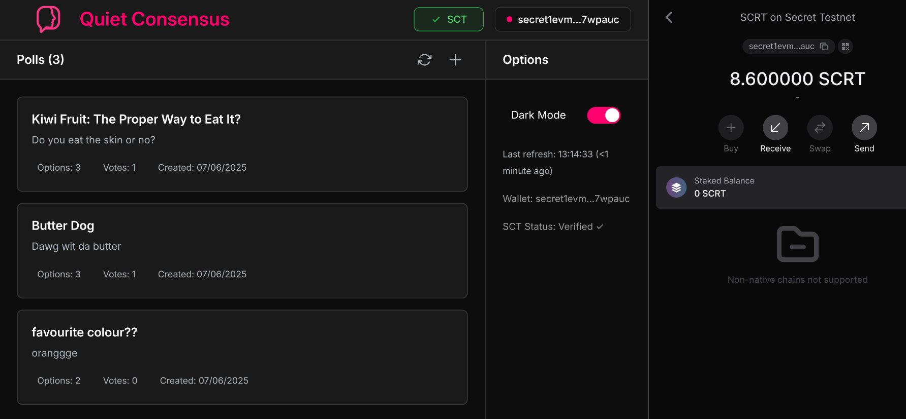
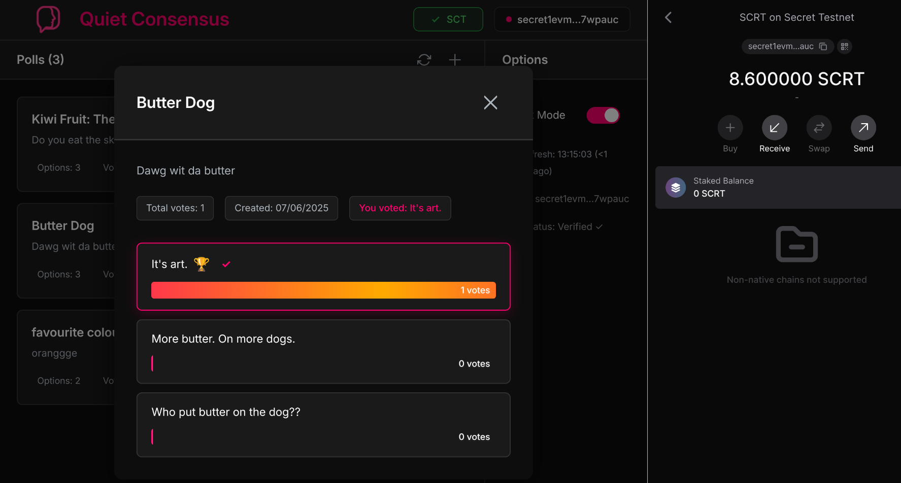
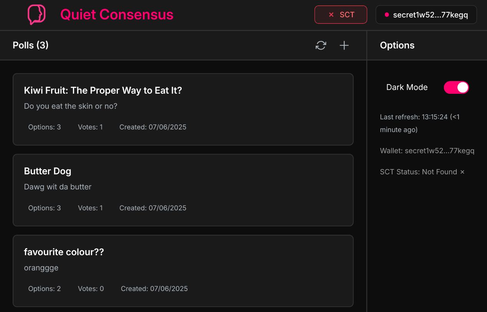
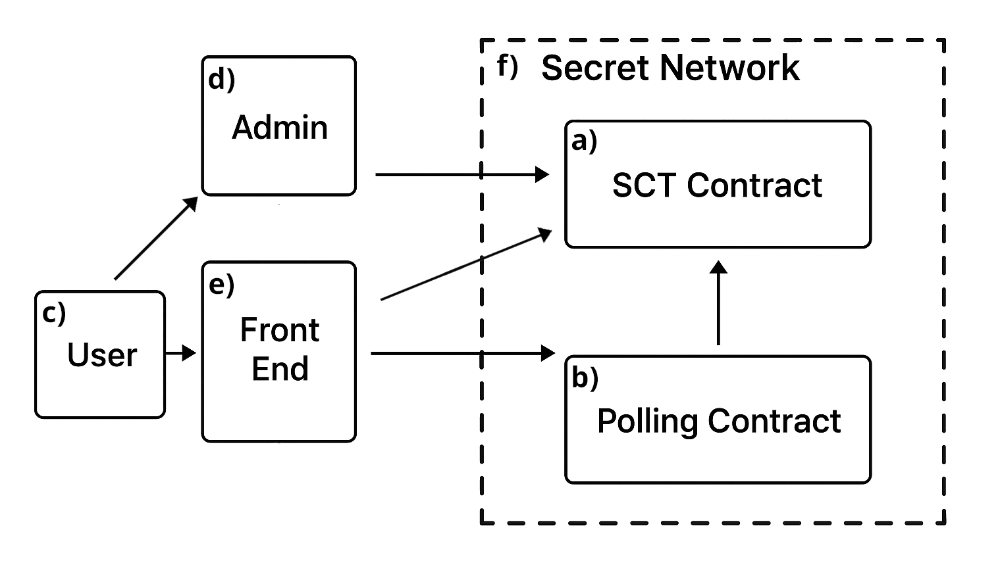

# quiet-consensus

Quiet Consensus is a proof-of-concept anonymous polling dApp made possible with the Secret Network. It only allows voting by individuals that hold a Soulbound Credential Token (SCT), ensuring that every vote originates from a single person, and no single person can vote multiple times. Quiet Consensus is accessible via a webpage and by using the Keplr wallet browser extension.


### Key Features
- **Perfectly anonymous polling**: Votes are completely private thanks to Secret Network
- **Sybil resistance**: Only SCT (Soulbound Credential Token) holders can vote, ensuring one person = one vote
- **Smooth frontend**: Intuitive React interface with automated permit handling


## Repository Structure

The Quiet Consensus repository consists of multiple stand-alone sub components

### Structure
```
quiet-consensus/
├── README.md
├── deploy-all.sh
├── docs/       ←  Documentation
│   ├── white-paper.md
│   └── philosophy.md
├── poll/       ←  Polling smart contract
│   ├── ...
│   └── ...
├── sct/        ←  SCT contract
│   ├── ...
│   └── ...
└── web/        ←  React app front end
    ├── ...
    └── ...
```

### Polling Contract Component (`poll/`)
- Polling contract source code
- Compilation of polling contract
- Deployment of polling contract

### Soulbound Credential Token Contract Component (`sct/`)
- Compilation of SNIP-721 contract
- Deployment of SCP (SNIP-721) contract
- Minting of SCPs

### Frontend Component (`web/`)
- Single page React web application
- Contains secretjs API with the polling and SCT contracts


## How to Deploy

This is a high-level overview of how to deploy all components of the Quiet Consensus project onto the Secret test net. 

This project was developed on linux and not tested on other OS's.

### 1. Instantiate and Mint SCTs

See `sct/creating_the_sct_contract.md` and `sct/minting_sct_nfts.md` for clear instructions.

1. Create admin account in Keplr and fund via faucet
2. Upload and instantiate SCT contract (`sct/uploader/`)
    (update `poll/uploader/src/config.ts` and `web/src/config.ts` with contract addresses and hashes)
3. Create user accounts in Keplr and fund them
4. Mint SCTs to users

### 2. Instatiate the Polling Contract

See `poll/creating_the_polling_contract.md` for clear instructions.

1. Compile polling contract (`poll/contract/`)
2. Upload and instantiate polling contract (`poll/uploader/`)
    (update `web/src/config.ts` with contract addresses and hashes)

### 3. Hosting the Front End

See `hosting_front_end.md` for clear instructions.

1. Ensure the correct contract addresses are set in `web/src/config.ts`
2. Run `npm install && npm run dev` in `web/` directory

### Full Auto-Deployment Script

Running `deploy-all.sh` will run all 3 deployment steps at once, though you may want to edit the script for a custom workflow.

```bash
cd ~/Repos/quiet-consensus/
chmod +x deploy-all.sh
./deploy-all.sh
```

## Gallery






Also see the video demonstration in `./docs/imgs/`.



***Figure 1.** Quiet Consensus architecture. **(a)** Soul-bound credential token (SCT) smart contract; **(b)** polling smart contract; **(c)** Quiet Consensus users; **(d)** off-chain issuing organisation (or "admin”) that mints SCTs to users; **(e)** web front-end through which users view, create and vote in polls; **(f)** the Secret Network which Quiet Consensus runs on.*


## Author
Haig Bishop 2025
