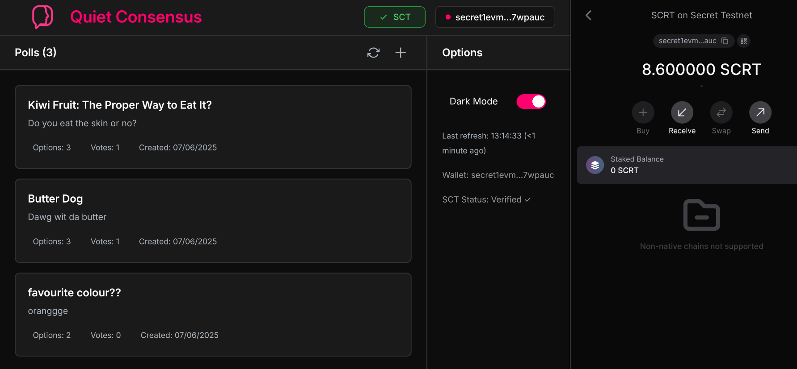

# Quiet Consensus White Paper

#### A Decentralised, Anonymous, Sybil-Proof Polling Service

 *- Haig Bishop 20 June 2025*

## Abstract 

Online polling is a widely used tool for group decision-making and gauging community sentiment, but its effectiveness is often undermined by two critical challenges: protecting voter privacy and preventing Sybil attacks, where one entity illegitimately casts multiple votes. Centralised solutions can address these issues but require users to trust a single authority, creating vulnerabilities to data breaches and manipulation. While decentralised alternatives offer trust-minimised solutions, they introduce significant complexity along with huge organisation costs, and sometimes maintain the need to trust a singular off-chain entity.

This white paper introduces Quiet Consensus, a decentralised, anonymous, and Sybil-proof polling service built on the Secret Network. The platform utilises a dual-contract architecture: a Soulbound Credential Token (SCT) contract to issue non-transferable "proof-of-humanity" tokens via a trusted off-chain entity, and a polling contract that allows only SCT holders to vote. By leveraging the inherent privacy features of the Secret Network, Quiet Consensus ensures that votes are confidential without the need for complex cryptographic techniques like zero-knowledge proofs. The result is a proof-of-concept of a simple, low-effort, and trustless polling service where poll results are publicly verifiable, yet the participation and votes of users are kept anonymous.

## Problem Statement & Motivation

#### Online Polling

Polling is a longstanding social practice used in a wide range of common situations such as democratic governance, censuses, group decision making and surveying of community sentiment. Naturally, with the advent of digital technology and the internet, digital versions of these practices have been employed, offering efficient and scalable services. 

Online polling is now widely used, implemented in a myriad of ways across the internet. However for some use cases, challenges can make online polling unreliable or even unusable. Quiet Consensus aims to solve two core challenges seen in the realm of online polling: the protection of voter privacy and resistance to Sybil attacks.

#### Voting Privacy

Due to social pressures, a voter's choice of vote or participation in voting can be influenced if they suspect that others might see their choice. For example, a social media user might refrain from answering an opinion poll due to their answer being perceived as controversial. Or, an employee might not voice their disagreement with a boss’s poor idea to avoid being the odd one out. By ensuring votes remain anonymous, it empowers voters to express their true preferences without the influence of social pressure. 

#### Sybil-Resistance

In computer science, a Sybil is a single entity pretending to be multiple entities in a system. Unfortunately, the vast and often anonymous nature of the internet can easily enable this phenomenon known as a Sybil attack. This threatens the principle of "one person, one vote", which is fundamental to polling. Resistance to Sybil attacks in any polling system is a fundamental feature which allows for polling results to be trusted as accurate.

#### Trustlessness

Polling services that are both private and Sybil-proof can be created by use of a centralised server to host the service. However with this approach, users must trust that the centralised service will act with integrity and successfully avoid malicious attacks. Unfortunately, this centralised approach is vulnerable to privacy breaches, there is no guarantee that user data will be kept private forever, and if dishonest manipulation of polls occurred, there would be no way for external users to detect it. 

By use of a decentralised blockchain, it is possible to create a private and Sybil-resistant polling service which is trustless. It is trustless because there is no central authority running the service, but instead the service is run on smart contracts which are programs stored on the blockchain. Since these smart contracts entirely exist as immutable programs on the blockchain, all user interactions with the smart contract happen according to the smart contract, and not according to some special authority. Therefore, if the smart contract is trusted (often thanks to a 3rd party audit), then users know that all their interactions with the smart contract will be executed with integrity.

#### The End Result

The aim of this work is a polling platform that has the three traits of: 1) trustless decentralisation, 2) anonymous voting, and 3) Sybil-resistance. 

The combination of these 3 traits creates significant technical challenge due to their inherent contradictions. Specifically, Sybil-resistance requires the verification of voter's identities, yet anonymous voting requires that voter's identities are not linked to their votes. Achieving both simultaneously on a decentralised blockchain system, which are almost always public and lack a central authority to handle private transactions, creates a significant technical paradox.

Despite technical challenges, Quiet Consensus acts as a proof-of-concept polling service that allows for public verification of genuine voting results without revealing individual participation or votes, all on a decentralised and trustless blockchain.

## Related Work & Context

#### Centralised Online Polling Services

As stated, it is relatively easy to create a centralised polling service which has both traits of anonymous voting and Sybil-resistance. Examples include Helios, ElectionBuddy and Simply Voting. These services can all provide anonymity and Sybil-resistance to polls, however as with any service running on a single centralised server, users must trust that the operator does not violate these properties or tamper with votes. For this reason, we shift focus towards decentralised services, where the requirement of trust can be removed using blockchain smart contracts and techniques such as zero-knowledge proofs that allow services to be publicly verifiable.

#### Minimal Anti-Collusion Infrastructure (MACI)

Minimal Anti-Collusion Infrastructure (MACI) is an Ethereum application that adds privacy and anti-collusion to voting [2]. To make voting private, votes are encrypted before submission, and an off-chain coordinator tallies them, then posts a zero-knowledge proof to confirm the result without revealing individual's choices publicly. And although it is not the primary focus of MACI, Sybil resistance is an optional feature allowing organisers to set up a "gate keeper" to require some external proof before allowing someone to vote. This "gate keeping" is flexible, enabling verification methods such as Gitcoin Passport or ownership of a particular NFT.

The key flaw of MACI is that the privacy of voting relies entirely on the singular off-chain coordinator. The coordinator is able to decrypt votes, opening the door to leaks, bribery and voter fraud. Using Quiet Consensus's approach, trustless privacy of voting is made possible, because at no point is it even possible for one account to view another accounts vote without their permission. MACI's flexibility available for Sybil defence is useful, but actually, it is merely off-loading the task to some external protocol. The Sybil-resistance of MACI is only as strong as the chosen external credential. Additionally, the coordinator has the power to whitelist voters bypassing any Sybil-resistance.

#### Decentralised Autonomous Vote Integrity Network with Cryptographic Immutability (DAVINCI)

DAVINCI is Vocdoni's new voting system built on Ethereum, though it has not yet been deployed in a real-world scenario [3]. Similar to MACI, DAVINCI involves vote encryption on the voter's device and tallying is performed off-chain and verified using zero-knowledge proofs. However, rather than trusting a single coordinator, the job is delegated to a group of sequencers who together release a zero-knowledge proof validating the final result, all while revealing nothing about individual votes. Unlike MACI's reliance on a single off-chain coordinator with the power to decrypt and possibly even fabricate votes, DAVINCI splits this task across a large number of nodes, so that no individual node has excessive power to take actions like viewing ballots or halting the poll. To address Sybil attacks, in the DAVINCI protocol voters must demonstrate eligibility by referencing their presence in a list of eligible voters published by the organiser. Although DAVINCI's Sybil-resistance is implemented differently to MACI, it is effectively similar with them both only being as strong as the underlying voter registry.

DAVINCI successfully avoids the single-coordinator flaw seen in MACI providing a far more trust-minimised system. However, it makes for a high-complexity protocol involving multiple zero-knowledge proofs, coordination of sequencers, creation of the voter registry and high poll organisation costs, making creation of polls a very high-effort task. Furthermore, without any real world deployment, claims of superiority should be treated with caution.

#### Key Limitations of Existing Polling Services

MACI integrates vote encryption and zero knowledge tally proofs on Ethereum making a valuable polling protocol. However the whole system relies on a single off-chain coordinator opening up several possibilities for breaches, errors and fraud. DAVINCI replaces the coordinator with a network of sequencers solving the singular point of failure, but introducing notable complexity.

DAVINCI has not yet been launched, but even so, both of these services come with a high cost and complexity to conduct making them suited to large scale elections. Quiet Consensus creates a service where any individual can create a poll with ease, knowing that the features of privacy and Sybil-resistance are built-in. This kind of service is well suited to the fast-paced and low-effort situations such as social media and small organisations.

Quiet Consensus provides a working proof-of-concept for a simple trustless online polling service that enables low-effort creation of custom polls with voter privacy and Sybil-resistance by using a native NFT.

## Architecture & Contract Design

#### Architecture Overview

Quiet Consensus consists of two custom smart contracts on the Secret Network blockchain: 1) the soulbound credential token (SCT) contract (Fig 1a), and 2) the polling contract (Fig 1b). 

SCTs are non-fungible tokens (NFTs) that represent a proof-of-humanity, without exposing identity. Users (Fig 1c) can be issued an SCT through an off-chain issuing organisation (Fig 1d). The role of the off-chain issuing organisation (also called the "admin") is to ensure each human may obtain a maximum of one SCT.

The polling contract (Fig 1b) holds the state of all polls on the Quiet Consensus service. Any user can view and create polls, but only users with a SCT are allowed to vote. To achieve this, the polling contract is able to query the SCT contract to verify a user's SCT ownership.

The front end (Fig 1e) to Quiet Consensus is a web application that allows users to interact with both the SCT contract and the polling contract via their Secret Network account. This front end enables seamless use of feature such as viewing polls, checking self-ownership of SCT tokens, creating polls, voting on polls, viewing poll tallies, etc.

Because the polling contract and SCT contract are implemented on the Secret Network (Fig 1f), which uses trusted execution environments to execute its smart contracts, all behaviour including SCT ownership, poll creation, and voting are entirely private.

***Figure 1.** Quiet Consensus architecture. **(a)** Soul-bound credential token (SCT) smart contract; **(b)** polling smart contract; **(c)** Quiet Consensus users; **(d)** off-chain issuing organisation (or "admin”) that mints SCTs to users; **(e)** web front-end through which users view, create and vote in polls; **(f)** the Secret Network which Quiet Consensus runs on.*

#### Soulbound Credential Tokens (conceptual)

On a conceptual level, soul-bound credential tokens (SCTs) are NFTs that represent proof-of-humanity. No individual human should be able to own more than one SCT. This is enforced by an off-chain issuing organisation which has access to the SCT contract admin account allowing them to mint SCTs. This issuing process looks like:

1) The individual communicates with the issuing organisation and confirms their human identity (Fig 1c,d).
2) The issuing organisation confirms that an SCT has not already been issued to this individual yet by checking their private off-chain records.
3) The individual provides their on-chain account address, and the issuing organisation mints a non-transferable SCT to that account (Fig 1d,a). 
4) The issuing organisation erases the address provided, but records the fact that this individual has been issued an SCT.

Once an SCT is minted, it cannot be transferred.

Therefore, if we trust:

1. The issuing organisation's ability to issue SCTs without mistake.
2. The individual doesn't lose or give away access to their account.

Then we can guarantee that no human has access to a more than one account that possesses an SCT.

*Note: This approach for proof-of-humanity acts partially as a placeholder to enable the creation of this proof-of-concept project.*

#### Soulbound Credential Tokens (technical)

On a technical level, soul-bound credential tokens (SCTs) are NFTs implemented using the SNIP-721 reference implementation [1], which is designed for the Secret Network. Upon instantiation of the SCT contract, the admin account belonging to the issuing organisation is specified, which grants the issuing organisation exclusive rights to mint SCTs to users. It is assumed that when the issuing organisation mints SCTs, they always specify transferable as false.

Beyond minting, the only function of an SCT is verification of ownership, but only with permission by the owner. By use of viewing keys, users are able to directly query the SCT contract to check whether or not they own an SCT. These viewing keys can be shared to allow other individuals or (more likely) smart contracts to independently check SCT ownership. 

Across the whole project, the only messages to the SCT contract used are **MintNft** and **SetViewingKey**. While the only query used is **Tokens**, which, with a valid viewing key, returns all tokens owned by the specified account.

#### The Polling Contract

The polling contract stores all polls as `POLLS` (consisting of a unique ID, title, description, creation time, options, and vote tally), all individual votes as `VOTES` (consisting of poll ID, voter address, and option index), a count of the total number of polls as `POLLS_COUNT`, and the address and code hash of the SCT contract.

The **GetPolls** query message, which can be used by anyone returns a list of all polls with results represented as a tally, not individual votes. The **GetNumPolls** query message acts similarly and simply returns the count of the number of polls. The **GetMyVote** query message returns the sender's vote (if any) on any specified poll. It requires a permit which restricts users from observing other user's votes. **GetMyVote** can be used by any user, however it is useless to users without SCTs, because they cannot vote. These three queries enable any user to view the details and results of all polls on Quiet Consensus with the desired privacy guardrails. 

The **MakePoll** execute message can be used by any user to create a new poll with any specified title, description and options. The only restrictions are that the title and options are unique and the number of characters and options in within their valid ranges.

The **CastVote** execute message takes a vote (a poll ID and an option index) as an argument, along with a SCT viewing key.  After checking the validity of the vote, the polling contract uses the viewing key to validate that the sender owns a SCT. Upon successful verification of SCT ownership, the vote is submitted which increments the tally on the poll, and records the specific vote for later retrieval.

#### Security Considerations

The off-chain SCT issuing organisation (admin) is a single point of failure that could easily orchestrate a Sybil attack. A stolen or reckless admin key could mint any number fake credentials and flood any poll. Adjacent to this issue is the fact that, although users cannot transfer their SCTs, they are able to give away their private keys to their accounts that hold SCTs. This effectively enables the sale of SCTs and therefore buying of votes. These SCT-related issues are recognised as key points of failure and are intended to be replaced in future work.

All privacy guarantees are lost if users interact through a malicious web page that fakes legitimate interaction with the Quiet Consensus smart contracts. Furthermore, the front end codebase is made totally open-source making it far easier to create a near identical user experience with slight malicious tweaks.

Neither the polling contract or the SCT is upgradeable. If a new feature needs to be implemented or a bug needs to be fixed, the contracts need to be redeployed. Currently there is no mechanism for migrating existing polls and SCT ownership records to the new contracts, so these will be lost.

Denial-of-service attacks are mitigated by gas fees when creating polls and voting on polls. However a motivated entity with enough resources could still bloat the system by generating huge amount of polls at once. Alternatively, if the number of polls on Quiet Consensus grows large enough, only a few **GetPolls** queries could potentially overload the system.

## Front End Workflow & UX

#### Front End Implementation Approach

The front end streamlines all essential interactions with the Quiet Consensus blockchain components for users to an intuitive UI (Fig 2 & Fig 3) that allows them to easily check SCT ownership, view polls, make polls and cast votes. The particular implementation was a React web application which communicated to the users Keplr wallet via the Keplr browser extension, and interacted with the two smart contracts using the secretjs library. 

***Figure 2.** The user interface of Quiet Consensus showing all 3 polls, a verified SCT ownership and the Keplr wallet interface on the right.*

***Figure 3.** The user interface of Quiet Consensus showing the details and results for a specific poll the user has voted on. Also visible is a verified SCT ownership and the Keplr wallet interface on the right.*

#### Initial Connection

Upon opening the Quiet Consensus web application, users are prompted to connect their Keplr wallet to securely interface with the Secret Network. Once connected, the application automatically verifies SCT ownership by obtaining a viewing key (with **SetViewingKey**) and using it to check SCT ownership by querying the SCT contract (with **Tokens**). At the same time, all available polls are fetched from the polling contract (with **GetPolls** and **GetNumPolls**) and presented to the user, with vote tallies visible but individual votes remaining private.

#### Viewing & Creating Polls

The main interface displays all polls in a scrollable list, showing titles, descriptions, vote counts, and creation times. Users can click any poll to view detailed results in a modal dialog. When opening the poll modal dialog, a **GetMyVote** message is executed to see if the user has voted, and if they have then the results are displayed accordingly in the UI. This model dialog also allows the user to cast votes (see below). Poll creation is accessible to all wallet-connected users via a **MakePoll** message that accepts a title, description, and 2-8 options. The application handles contract interaction errors gracefully, providing clear feedback when poll creation fails due to network issues or invalid inputs.

#### Casting Votes

Voting requires the application to first obtain or retrieve a SCT viewing key for the user. This key is automatically created and stored when needed, then included in **CastVote** messages to prove SCT ownership to the polling contract. Upon a successful vote, the interface refreshes now showing their own vote. Users without valid SCTs receive a clear error message explaining the credential requirement.

## Implementation Choices & Trade‑Offs

#### Secret-Network-Based Privacy

As seen in other decentralised polling services, client-side encryption along with zero-knowledge proofs can be used to provide privacy. Instead, Quiet Consensus operates on the Secret Network which comes with built-in privacy through the use of trusted execution environments, where all contract code encrypted at all times except when it is executed inside an Intel SGX enclave. Choosing this model removes a huge amount complexity including generation of zero-knowledge proofs, organising an off-chain coordinator (or off-chain sequencers), and custom encryption of votes in the clients browser . This complexity reduces computational load and allows for quicker development of the service. The trade-off is that users must trust the integrity of Secret Network’s trusted execution environments. In my view, this trade-off is worth it because I trust in the security of the trusted execution environment approach, and the significant complexity reduction speeds up development and reduces the attack surface for any malicious actors.

#### Polling Contract Storage 

The polling contract stores just one `POLLS` map (`poll_id` -> `poll`), one `VOTES` map (`(poll_id, voter_addr)` -> `vote`), and a single `POLL_COUNT` integer holding the total number of polls. This solution makes the most important operations fast, for example looking up a user's vote on a specific poll, getting the number of polls, or getting the tallied results for a particular poll. Operations such as fetching all user addresses that voted on a particular poll requires walking the entire `VOTES` map and would be extremely slow. But this is acceptable, because the only time specific votes are recalled is when a user queries their own vote, and in this situation they can use the perfectly suited `VOTES` map. However in future the polling contract may benefit from being able access vote records in different ways, in which case `POLLS` could be adapted to store individual vote data along with tallies.

#### Dual-Contract Design

SCT ownership is implemented as non-transferable NFTs using a separate SNIP-721 contract rather than being implemented into the polling contract. Splitting the protocol into two contracts comes with multiple benefits: 1) every time the polling contract is reinitialised, SCT ownership is not erased, 2) the admin privileges of the issuing organisation are clearly only for the SCT contract and distinct from the polling contract, 3) the polling contract checks SCT ownership in the same way that any individual user (manually or using a front end) would by using a viewing key, 4) the behaviour and interaction with SCT is familiar because it follows the SNIP-721 specification which is based on the widely used CW-721 and ERC-721 specifications [1]. The downside to this choice is that every single vote triggers an inter-contract query that uses a viewing key, likely reducing the throughput of Quiet Consensus considerably. A single integrated contract would be able to check SCT ownership much faster and for free.

## Future Work

This section consists of a set of potentially valuable steps in the future development of Quiet Consensus. Some of them are not compatible with each other, and they should be considered as merely ideas for future work.

#### Selective Presentation of Polling Results

There are two key reasons for why polling results possibly should not be shown in real time and before a poll closes: 1) for very small polls, live tallies can effectively deanonymise votes by process of elimination and probability, and 2) voters seeing the premature results of a poll can bias their own vote on that poll. Currently, polls make tallies available at all times with instant updates upon new votes. However in future development, polls should by default be given an expiry, at which time, votes are finalised and results are revealed. This could be totally optional according to the poll's creator or a compulsory feature.

#### SCT Recovery

The SCT issuing organisation is allowed to mint SCTs, but nothing else, and SCTs are non-transferable. This means that if a user loses access to their account, they lose their SCT permanently. A simple solution would be that the user can return to the issuing organisation and request a "burn-and-replace", which burns the user's previous SCT and issues a new one to a new account. This would however require that the issuing organisation keeps records of who owns what account.

#### SCTs with Group Identity and Demographics

Currently, SCTs are effectively the same, simply representing proof of being a human. But it is entirely possible to allow SCTs to carry some extra demographic metadata such as age, nationality, sex, etc. This metadata could be made visible only to the polling contract, which should report it in a useful way without compromising anonymity. 

In a similar vein, community made SCTs could be allowed giving people the ability to create their own SCT for a particular organisation, movement, or club. Specifically, anyone could make a SCT and assign their chosen account as the admin giving them to power to mint and therefore decide who belongs to that club. Then, polls can be created which only allow individuals with that type of SCT to view and vote on them. This would require a modification of the SNIP-721 contract, along with the polling contract and front end.

#### Alternative Sybil-Resistance Approach

Currently, SCTs have a major flaw in that accounts with SCTs can be sold, which enables buying of SCTs and therefore buying of votes. It seems likely that the solution to this will involve a very different (and probably quite sophisticated) approach like that of WorldCoin, BrightID, or Proof of Humanity, which use biometrics, social graphs, and video verification, respectively. The easiest approach for Quiet Consensus would be to add flexibility to query a chosen external system similar to how DAVINCI and MACI handle this. This flexibility could allow for polls to require proof of humanity, proof of group membership, or no proof at all.

#### Anti-Collusion Measures

The polling service MACI focuses on anti-collusion and in doing so votes were made to be private. Quiet Consensus, however has largely overlooked collusion prevention, an important issue that needs to be addressed. If a user can prove who they voted for, then collusion is made significantly easier. Currently, Quiet Consensus uses permanent SCT viewing keys that let any user prove their vote at any time. Additionally, the current polling contract enforces that if a user has already voted on a poll, they cannot vote again to change their vote. To prevent collusion, Quiet Consensus should: 1) allow users to change their vote, 2) make the viewing of votes ephemeral so that any time a vote is checked, the voter must be involved in the transaction, and 3) add a (e.g. 2 hour) cool down period before polls close where voting is allowed, but checking votes is disallowed. With changes such as these, I think Quiet Consensus can be just as good as MACI at preventing collusion. In fact, it could be even stronger, because MACI's single coordinator is a point of failure that enables white listing of particular voter addresses and deanonymisation of votes.

## References
[1] "SNIP-721 Reference Implementation." Secret Network. Available: https://github.com/baedrik/snip721-reference-impl.

[2] "What is MACI?" Privacy and Scaling Explorations (PSE). Available: https://maci.pse.dev/docs/introduction.

[3] "DAVINCI Protocol Whitepaper." Vocdoni. Available: https://hackmd.io/@vocdoni/BJY8EXQy1x.

